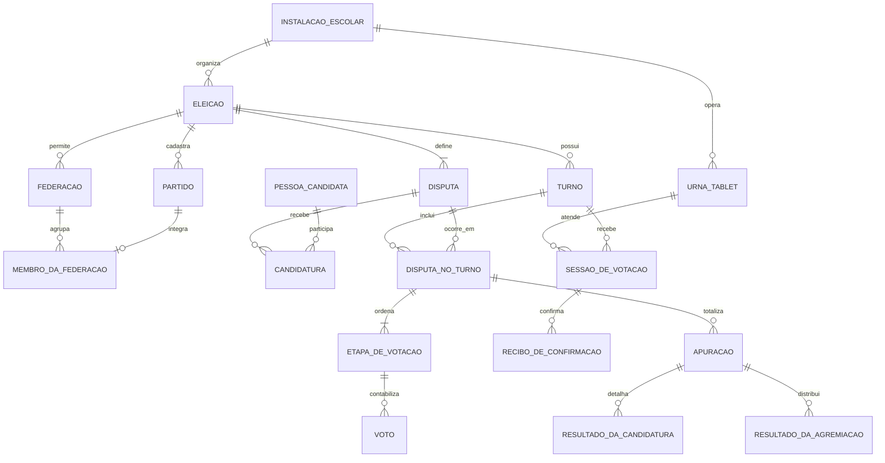

# Contexto integral — ERS, SDD, ADR e prioridades

Fontes preservadas integralmente. Os estados de implementação e ordens de trabalho das fontes antigas são históricos. Consulte o briefing e o OpenAPI do snapshot atual.

---

## Documento integral: ERS-v0.1.md

# Especificação de Requisitos de Software — Simulador Eleitoral Escolar

**Projeto:** election-rb  
**Versão:** 0.1 — 25/09/2026  
**Estado:** base para revisão de produto e implementação  
**Referência de código:** commit `184538e5bb1f6afe291b87317cac9047175ce779`  
**Referência normativa:** regras brasileiras vigentes para 2026, quando aplicáveis ao perfil escolhido.

## 1. Objetivo e limites

O sistema permite que uma escola organize eleições próprias e simulações didáticas de votação brasileira. Cada escola instala e opera seu próprio sistema e seus próprios dados. Uma eleição contém uma sequência configurável de disputas por cargo, cada qual com forma de apuração escolhida pelo criador.

O sistema **não é uma urna oficial**, não substitui a Justiça Eleitoral e não comprova sozinho que uma pessoa votou apenas uma vez. A escola confere a identidade e marca a participação em uma lista física. O aplicativo não cadastra eleitores nem grava sua identidade junto aos votos.

Esta ERS descreve o produto desejado; o README e o esquema atuais são um protótipo e deverão ser adaptados. **Atualização de escopo em 26/09/2026:** a interface do eleitor pode ser usada em celular, tablet ou computador. As menções a “tablet” nesta versão designam um dispositivo de votação controlado pela escola, sem restringir o formato físico. A quantidade de dispositivos simultâneos por escola ainda não foi fixada.

### 1.1 Vocabulário

| Termo | Significado nesta ERS |
| --- | --- |
| Eleição | Evento organizado por uma escola, com calendário, disputas, partidos e administração próprios. |
| Disputa | Cargo colocado em votação em uma eleição, com ordem, vagas e método de apuração. |
| Escolha | Uma confirmação de voto para uma etapa da disputa; uma disputa pode exigir duas escolhas, como o Senado em 2026. |
| Sessão | Uso temporário e anônimo da interface do eleitor após liberação pelo mesário. |
| Dispositivo de votação | Celular, tablet ou computador provisionado para executar a interface do eleitor; fica bloqueado entre sessões. |
| Chapa | Candidatura de titular e vice para disputa configurada com vice. |
| Federação | Agrupamento opcional de partidos cujos votos são somados na apuração proporcional. |
| Resultado parcial | Contagem e percentuais ainda sujeitos a novos votos, sem declaração de vencedores. |

## 2. Origem das regras e precedência

1. **Decisões de produto aprovadas pelo responsável do projeto:** escolhas registradas nas conversas de 25/09/2026, inclusive alterações posteriores. Valem para a simulação escolar.
2. **Perfil brasileiro de 2026:** fórmulas e tratamentos expressamente referenciados nesta ERS, com fontes oficiais do TSE. Cargos personalizados usam o método selecionado; o nome do cargo não escolhe o método automaticamente.
3. **Lacunas escolares:** quando a regra oficial exigir dados ou instituições que a simulação não modela, o sistema informa `resultado pendente` e registra a ocorrência; não inventa vencedor.

Simplificações deliberadas: não modelar suplentes nem coligações de chapas; permitir titular e vice filiados a partidos diferentes sem cadastrar a aliança. Federações **são opcionais** e existem apenas para agregar partidos conforme as regras de apuração aplicáveis. Essas simplificações devem aparecer na apresentação do resultado.

## 3. Atores e permissões

| Ator | Permissões |
| --- | --- |
| Criador da eleição | Cadastra e configura eleição, disputas, ordem, partidos, federações, candidaturas, mesários e tablets; agenda turnos; abre, suspende, retoma, encerra e, com justificativa, anula uma eleição; publica relatório final. |
| Mesário | Autentica-se em interface própria; após conferência física da pessoa, libera uma sessão no tablet; acompanha somente o estado da sessão, registra ocorrências e trata abandono ou falha técnica. Não vê escolhas da sessão. |
| Eleitor | Usa a sessão liberada; vota em cada disputa, na ordem configurada; confirma cada escolha. Não precisa de conta no aplicativo. |
| Público | Consulta participação, contagens e percentuais parciais durante a votação; após o fechamento, consulta resultado final e relatório de apuração. Não acessa votos individuais ou dados de sessão. |

**RF-01.** O primeiro criador da instalação deve ser provisionado por procedimento seguro. Toda ação administrativa e de mesário exige autenticação e autorização no servidor.  
**RF-02.** A eleição pertence à instalação de uma escola. Não há consolidação de votos, cadastro ou autenticação entre escolas.  
**RF-03.** O criador é responsável pelas operações administrativas da eleição. Ele não pode editar nem apagar um voto confirmado.

## 4. Configuração da eleição

**RF-04.** O criador informa título, descrição, fuso horário, período de votação e sequência das disputas. A sequência é definida na criação e pode ser alterada somente antes da abertura.  
**RF-05.** Cada disputa recebe nome, número de vagas, método (`maioria_simples`, `maioria_absoluta` ou `proporcional`), quantidade de escolhas por eleitor, indicação de vice e referência à versão das regras de apuração.  
**RF-06.** O sistema valida a configuração: disputa proporcional aceita **uma escolha por eleitor**, independentemente do número de vagas, e não admite vice; maioria com uma vaga aceita uma escolha; maioria simples com duas vagas pode aceitar duas escolhas distintas. Maioria absoluta exige uma única vaga. Combinações fora dos perfis suportados não podem ser abertas.  
**RF-07.** O criador cadastra partidos com número e sigla únicos na eleição. Cada candidatura tem número único na disputa e filiação a um partido participante.  
**RF-08.** O criador pode cadastrar uma federação e associar partidos participantes. Um partido não pode integrar duas federações na mesma eleição. A federação vale para a distribuição de vagas proporcionais; a candidatura continua filiada a seu partido.  
**RF-09.** Disputas com vice exigem titular e vice na mesma chapa. Ambos possuem filiação partidária, que pode ser diferente. O eleitor escolhe a chapa pelo titular; o vice não recebe voto independente.  
**RF-10.** A abertura exige calendário válido, ao menos uma disputa e candidaturas consistentes com cada método. Após a abertura, ficam congelados ordem, método, vagas, partidos, federações e candidaturas. Incidente que exija alterar esses dados deve seguir procedimento de suspensão/anulação, com motivo auditado.  
**RF-11.** O sistema mostra ao criador uma prévia completa da cédula e das regras antes da abertura, inclusive a ordem e o número de confirmações por disputa.

### 4.1 Quantidade de escolhas

| Perfil | Vagas | Escolhas por pessoa | Exemplo |
| --- | ---: | ---: | --- |
| Maioria absoluta | 1 | 1 | Presidente ou governador na simulação. |
| Maioria simples | 1 | 1 | Senador em pleito de uma vaga. |
| Maioria simples | 2 | 2, em etapas separadas | Senado em 2026. |
| Proporcional | Uma ou mais | 1 candidato **ou** 1 legenda | Vereador ou deputado. |

Para disputa majoritária personalizada com mais de duas vagas, esta versão da ERS **não presume** um mecanismo brasileiro equivalente; a configuração permanece indisponível até haver uma regra específica aprovada.

## 5. Calendário, turnos e estados

**RF-12.** A eleição possui estados `rascunho`, `agendada`, `aberta`, `suspensa`, `encerrada` e `anulada`. Transições são registradas com ator, horário e motivo quando exigido.  
**RF-13.** Somente sessões liberadas enquanto a votação está aberta podem começar. Ao horário de encerramento, nenhuma nova sessão é liberada; uma sessão já iniciada pode terminar em até **10 minutos**. Após essa tolerância, o criador encerra o turno e resolve sessões pendentes conforme o procedimento de incidentes.  
**RF-14.** Em disputa de maioria absoluta, se nenhuma chapa/candidatura superar metade dos votos válidos no primeiro turno, o sistema prepara segundo turno com as duas mais votadas. O segundo turno ocorre **em outro dia**, com nova abertura, votação e lista física de participação própria. Os votos do primeiro turno permanecem preservados e identificados por turno.  
**RF-15.** O segundo turno inclui apenas as disputas que dele necessitam. O resultado do primeiro turno não é misturado ao segundo. O relatório mostra ambos.  
**RF-16.** A eleição só declara vencedores após o encerramento do turno pertinente e a conclusão da apuração. Antes disso, qualquer exibição é identificada como parcial.

## 6. Sessão do eleitor e registro dos votos

**RF-17.** A escola confere a pessoa e marca a lista física antes de o mesário liberar o tablet. Essa verificação não é digitada no aplicativo. Cada liberação cria uma única sessão anônima, registrada no servidor.  
**RF-18.** O mesário libera a sessão por botão em interface própria. A atualização do tablet pode usar WebSocket, mas o estado persistido no servidor é a autoridade; mensagens repetidas ou reconexões não criam sessões extras.  
**RF-19.** O eleitor percorre todas as disputas da eleição, na ordem definida pelo criador. Em disputa de duas escolhas, as etapas aparecem em sequência.  
**RF-20.** Em cada etapa, o eleitor pode escolher candidatura apta, voto em branco ou voto nulo. Na disputa proporcional pode votar na legenda do partido. Entrada numérica que não corresponda a candidatura apta segue o tratamento de voto nulo ou de legenda da regra aplicável, com aviso antes de confirmar.  
**RF-21.** O voto escolhido pelo eleitor em cada etapa é gravado **somente** após `Confirmar`. O servidor confirma a gravação antes de avançar. A confirmação é atômica e idempotente: reenvio do mesmo comando não duplica nem troca o voto. A única exceção de contabilização sem clique é o nulo administrativo de etapa abandonada previsto em RF-25.  
**RF-22.** Após a confirmação bem-sucedida de **cada etapa**, o tablet reproduz uma vez o som característico de confirmação da urna. Não reproduz o som quando a gravação falha ou ainda está pendente. O som não revela a escolha.  
**RF-23.** Um voto confirmado é imutável e continua válido se a pessoa abandonar etapas posteriores. Após a última etapa, a sessão termina e o tablet bloqueia até a liberação de outra pessoa.  
**RF-24.** Quando houver duas escolhas majoritárias para vagas distintas, a segunda escolha do mesmo candidato gera aviso e, se confirmada, é computada como nula para a segunda etapa, conforme o perfil de Senado de 2026.  
**RF-25.** Se a pessoa abandonar a votação, o mesário primeiro a orienta a concluir. Persistindo a desistência, os votos já confirmados permanecem e cada etapa não confirmada recebe um nulo **administrativo por abandono**, distinto de um nulo escolhido e confirmado pelo eleitor; a ocorrência e o motivo são registrados sem identificar as escolhas.  
**RF-26.** Se a conexão cair, o tablet mostra estado de espera e consulta o servidor ao reconectar. Uma etapa só é mostrada como confirmada após resposta inequívoca de gravação. A sessão pode retomar da próxima etapa ainda não confirmada; falha técnica não é classificada automaticamente como abandono.  
**RF-27.** A mesma sessão não pode confirmar mais de uma vez a mesma etapa nem votar fora da ordem. Uma nova liberação do tablet exige que a sessão anterior esteja concluída ou formalmente encerrada por ocorrência.

## 7. Apuração

**RF-28.** Contabilizar separadamente, por eleição, turno, disputa e etapa: votos nominais, de legenda, brancos e nulos. Brancos e nulos entram no total de votos emitidos daquela etapa, mas não no denominador dos votos válidos usado para decidir vencedores. **Participação** é contagem de sessões de pessoas que iniciaram a votação, apresentada separadamente dos votos emitidos; uma pessoa pode confirmar várias etapas.  
**RF-29.** Em maioria simples, ordenar candidaturas ou chapas pelos votos válidos nominais e preencher o número de vagas da disputa, sujeito aos casos de empate ou insuficiência de candidaturas.  
**RF-30.** Em maioria absoluta, eleger no primeiro turno quem tiver **mais de 50% dos votos válidos** da disputa. Caso contrário, aplicar RF-14. No segundo turno, eleger a candidatura/chapa com mais votos válidos, quando houver decisão inequívoca.  
**RF-31.** Em proporcional, votos nominais e de legenda válidos compõem o quociente eleitoral (QE). Votos de partidos que integram a mesma federação são somados para o quociente partidário (QP) e a distribuição de vagas. O voto de legenda conta para a agremiação, não como voto nominal de candidato.  
**RF-32.** O perfil proporcional 2026 deve implementar a sequência oficial: QE pelo número de votos válidos dividido pelas vagas, com arredondamento da fração conforme a regra oficial; QP por partido/federação, descartando a fração; preenchimento inicial com candidaturas que atingirem o desempenho nominal mínimo; distribuição das vagas restantes por médias e suas fases de elegibilidade, inclusive quando ninguém atinge o QE. O cálculo deve produzir memória detalhada e reproduzível, sem usar apenas `votos ÷ vagas` como resultado final.  
**RF-33.** Nas vagas iniciais do QP, a candidatura precisa alcançar ao menos **10% do QE**. Na primeira fase de sobras, aplicam-se os critérios de **80% do QE** para partido/federação e **20% do QE** para candidatura. Quando não houver mais elegíveis nessa fase, aplicam-se as regras oficiais de maiores médias para as cadeiras restantes.  
**RF-34.** O sistema registra a versão do algoritmo e os dados usados na apuração; reprocessar os mesmos votos e parâmetros produz o mesmo resultado. O relatório apresenta QE, QP, médias, vagas por partido/federação, candidatos eleitos e justificativa de vaga não preenchida.  
**RF-35.** Em empate, zero votos válidos, QE igual a zero na simulação proporcional, candidatura única que não permita segundo turno, falta de dados de desempate ou insuficiência de candidaturas, o sistema aplica uma regra oficial **somente se estiver explicitamente implementada e verificável**. Caso contrário, marca a disputa `resultado pendente`, apresenta o motivo e impede declarar vencedor automaticamente. Nunca divide por QE igual a zero.

### 7.1 Percentuais exibidos

**RF-36.** Durante a votação, o público vê o número de confirmações por disputa e a porcentagem parcial de votos de cada candidatura. O percentual nominal é `votos nominais da candidatura ÷ votos válidos confirmados da disputa × 100`. Na proporcional, votos de legenda integram o denominador válido e são mostrados separadamente; brancos e nulos também são mostrados separadamente. Com denominador zero, exibir `—`, não `0%`.  
**RF-37.** Os números públicos são derivados de votos já confirmados no servidor. Atualizam-se após novas confirmações, identificados como **parciais**, sem rótulo de vencedor ou eleição concluída. Percentuais finais e relatório só recebem estado `final` após encerramento e apuração.  
**RF-38.** Publicar porcentagens por candidatura durante a votação cria risco de inferir o voto recém-registrado, sobretudo em grupos pequenos. A documentação da instalação deve informar essa limitação; a interface pública não mostra ordem de chegada, identificadores de sessão, terminal nem horário de votos individuais.

## 8. Transparência, auditoria e incidentes

**RF-39.** Registrar, em trilha de auditoria separada dos votos: ator autenticado, ação, eleição, data/hora, resultado e justificativa quando aplicável para criação, configuração, abertura, liberação de sessão, suspensão, retomada, encerramento e anulação. Não registrar opção votada, número digitado pelo eleitor ou relação entre identidade física e sessão.  
**RF-40.** O criador pode suspender e retomar a votação com motivo. A anulação exige confirmação e motivo e preserva os dados para auditoria; não apaga nem altera votos. Uma eleição anulada não declara vencedores. Refazer a votação exige nova eleição ou novo turno explicitamente identificado, sem sobrescrever o anterior.  
**RF-41.** Depois do encerramento, o público pode obter relatório com configuração congelada, período de votação, turnos, participação, votos válidos, brancos, nulos, totais por candidatura/legenda, cálculo e ocorrências relevantes. Dados de autenticação, sessões e votos individuais não aparecem no relatório.  
**RF-42.** O sistema permite confrontar total de etapas confirmadas com a soma de todas as categorias de voto por disputa/etapa. Divergência impede publicação final e gera ocorrência auditável.

## 9. Entidades e relações do domínio

Este é o **modelo lógico do produto**, independente dos nomes de classes Rails ou tabelas existentes. `ID` significa identificador interno sem significado eleitoral. Campos marcados como opcionais só podem ficar vazios nas condições descritas. O projeto físico do banco deve preservar as relações e restrições abaixo.

### 9.1 Entidades de configuração

| Entidade | Atributos essenciais | Regras |
| --- | --- | --- |
| **InstalaçãoEscolar** | ID, nome público da escola, fuso horário padrão, identificador da instalação. | Representa uma implantação isolada; pode conter várias eleições ao longo do tempo. Não se conecta a instalações de outras escolas. |
| **Usuário** | ID, nome, login único na instalação, segredo de autenticação protegido, estado da conta. | Conta do criador ou de mesário. Senha em texto simples nunca é atributo permitido. |
| **PapelNaEleição** | usuário, eleição, papel `criador` ou `mesário`, situação. | Controla permissões por eleição. O criador não ganha acesso a votos individuais por causa do papel. |
| **Eleição** | ID, instalação, criador, título, descrição, estado, fuso horário, versão da configuração congelada, data de criação. | Pertence a uma instalação. Pode ter um ou dois turnos; não pode abrir sem ao menos uma disputa válida. |
| **Turno** | ID, eleição, número `1` ou `2`, início, fim, limite de tolerância, estado. | Segundo turno tem outra data e só existe quando uma disputa de maioria absoluta exige nova votação. Cada turno tem contagem própria. |
| **Disputa** | ID, eleição, nome do cargo, ordem positiva e única na eleição, método, número de vagas, número de escolhas por pessoa, `tem_vice`, versão da regra. | É o cargo **dentro daquela eleição**; o nome não determina o método. Não se altera após abertura. |
| **DisputaNoTurno** | turno, disputa, situação de inclusão. | Associa cada disputa ao primeiro turno e, somente quando necessário, ao segundo; a ordem segue a configuração da eleição. |
| **Partido** | ID, eleição, nome, sigla, número, estado. | Número e sigla únicos dentro da eleição. Participa de uma federação ou concorre isolado. |
| **Federação** | ID, eleição, nome, sigla opcional, estado. | Opcional. Agrega ao menos dois partidos da mesma eleição para a apuração proporcional; não substitui a filiação partidária individual. |
| **MembroDaFederação** | federação, partido. | Um partido integra no máximo uma federação na mesma eleição. Composição congelada na abertura. |
| **PessoaCandidata** | ID, nome público, foto opcional, data de nascimento opcional e protegida. | Não é eleitor cadastrado. Data de nascimento só deve ser exigida se uma regra de desempate adotada precisar dela. |
| **Candidatura** | ID, disputa, pessoa titular, partido do titular, número de urna, pessoa vice opcional, partido do vice opcional, situação. | É uma opção de voto. Em disputa com vice, ambos são obrigatórios e podem ter partidos distintos. Número único na disputa. Uma pessoa não pode ocupar duas candidaturas incompatíveis na mesma disputa. |
| **CandidaturaNoTurno** | turno, candidatura, situação de habilitação. | Restringe a cédula do segundo turno às duas candidaturas habilitadas. Nunca move votos de um turno para outro. |

**Observação de modelagem:** `Candidatura` já representa a chapa quando há vice; não é necessário duplicar o conceito em uma tabela `Chapa`. A pessoa vice não aparece como opção independente de voto. O partido continua vinculado à candidatura mesmo quando integra federação.

### 9.2 Entidades da operação de votação

| Entidade | Atributos essenciais | Regras |
| --- | --- | --- |
| **UrnaTablet** | ID, instalação, identificador público curto, estado `bloqueada`/`liberada`/`em_votação`/`indisponível`, credencial do dispositivo protegida. | Um ou mais tablets podem ser cadastrados na instalação; quantidade efetiva do piloto está em aberto. Nunca armazena voto escolhido em campo acessível ao mesário. |
| **SessãoDeVotação** | ID aleatório, turno, tablet, início, etapa atual, estado, fim e motivo operacional de encerramento. | Não contém nome, matrícula, documento ou identificador da lista física. Uma urna tem no máximo uma sessão ativa. O mesário pode ver estado, não escolhas. |
| **EtapaDeVotação** | disputa no turno, posição dentro da sequência, índice da escolha dentro da disputa. | Catálogo congelado ao abrir o turno. Em disputa proporcional há uma etapa; no Senado de duas vagas, duas etapas. Define o que pode ser confirmado em cada posição. |
| **ReciboDeConfirmação** | sessão, etapa, chave idempotente, estado confirmado, horário operacional. | Combinação sessão + etapa é única. Serve para reconhecer reenvios sem armazenar a escolha do voto. É dado operacional restrito, nunca público. |
| **Voto** | ID interno, turno, disputa, etapa, tipo `nominal`/`legenda`/`branco`/`nulo`, origem `confirmação`/`abandono`, candidatura opcional, partido opcional. | Imutável. `nominal` exige candidatura da disputa/turno; `legenda` exige partido da eleição e disputa proporcional; `branco`/`nulo` não apontam para candidatura ou partido. Origem `abandono` só permite nulo. Não guarda identidade do eleitor, ID de sessão ou ID do tablet. |
| **ProgressoTransitório** | sessão, etapa, apenas os dados mínimos necessários à validação e retomada. | Pode reter temporariamente a primeira candidatura de disputa com duas escolhas para detectar repetição. Acesso interno restrito; descartado após término da janela de recuperação. Não compõe relatório ou trilha pública. |
| **Ocorrência** | ID, eleição/turno, sessão opcional, tipo, momento, mesário/criador responsável, justificativa. | Descreve desistência, queda de conexão, suspensão e outras falhas sem opção votada ou identificação física da pessoa. |

Para voto de origem `confirmação`, o **recibo** e o **voto** devem ser criados na mesma operação atômica: ou ambos existem, ou nenhum existe. O recibo impede uma segunda gravação para a mesma sessão e etapa sem carregar a escolha. Para encerramento por abandono, a operação atômica registra a ocorrência, os nulos administrativos das etapas restantes e o fim da sessão; nenhuma dessas etapas recebe recibo de confirmação do eleitor. Não se cria vínculo durável `Voto → SessãoDeVotação`. Essa separação reduz a possibilidade de reconstruir a cédula completa de uma pessoa. O desenho físico ainda deve avaliar metadados de horário, índices, logs técnicos e acesso de administradores do banco, que podem gerar correlação indireta.

### 9.3 Entidades de apuração e prestação de contas

| Entidade | Atributos essenciais | Regras |
| --- | --- | --- |
| **Apuração** | ID, turno, disputa, versão do algoritmo, estado `parcial`/`final`/`pendente`/`anulada`, data de cálculo, totais, memória detalhada e motivo de pendência. | Cada execução é reproduzível a partir dos votos confirmados e da configuração congelada. Estado `final` exige turno encerrado e reconciliação dos totais. |
| **ResultadoDaCandidatura** | apuração, candidatura, votos nominais, percentual, posição, situação de eleita/pendente. | Não declara pessoa eleita em apuração parcial. Percentual segue o denominador definido em RF-36. |
| **ResultadoDaAgremiação** | apuração, partido ou federação, votos válidos atribuídos, QE, QP, médias e vagas. | Usado na proporcional; mostra como votos de partidos federados foram agregados e como vagas foram distribuídas. |
| **EventoDeAuditoria** | ID, eleição, ator autenticado, ação, data/hora, resultado e motivo opcional. | Não contém voto escolhido nem nome da pessoa que votou. É separado de `Voto`; parte agregada e não sensível alimenta o relatório público. |
| **RelatórioFinal** | eleição/turno, versão, data de publicação, estado, referência à apuração e ao resumo de ocorrências. | Só é publicado após encerramento e reconciliação. Em eleição anulada ou resultado pendente, identifica claramente a situação, sem inventar vencedores. |

`Apuração`, seus resultados e `RelatórioFinal` podem ser projeções/arquivos gerados a partir dos dados imutáveis; não precisam necessariamente ser tabelas separadas. A implementação deve permitir reprocessar e comparar versões sem sobrescrever o histórico publicado.

### 9.4 Cardinalidades e integridade

| Relação | Cardinalidade e restrição |
| --- | --- |
| InstalaçãoEscolar → Eleição | 1 para muitas; eleição pertence a exatamente uma instalação. |
| Eleição → Turno / Disputa / Partido | 1 para muitos; filhos não podem referenciar outra eleição. |
| Eleição → Federação | 1 para zero ou muitas; membros pertencem à mesma eleição. |
| Turno ↔ Disputa | Muitos para muitos via `DisputaNoTurno`; segundo turno contém apenas disputas elegíveis. |
| Disputa → Candidatura | 1 para muitas; número único por disputa. |
| Federação ↔ Partido | 1 para muitos via `MembroDaFederação`; partido tem zero ou uma federação na eleição. |
| Turno ↔ Candidatura | Muitos para muitos via `CandidaturaNoTurno`; candidatura só concorre em turno de sua disputa. |
| UrnaTablet → SessãoDeVotação | 1 para muitas no histórico, no máximo uma ativa de cada vez. |
| SessãoDeVotação → ReciboDeConfirmação | 1 para zero ou muitos, no máximo um por etapa. |
| Turno/Disputa/Etapa → Voto | 1 para muitos; todo voto pertence a uma etapa válida do turno. |
| DisputaNoTurno → Apuração | 1 para zero ou muitas versões; no máximo uma versão final publicada por vez. |

**Invariantes adicionais:** (a) `Voto` não aceita candidato de outra disputa, partido de outra eleição nem legenda em disputa majoritária; (b) branco e nulo nunca recebem candidatura fictícia; (c) estados de eleição, turno, sessão e tablet só mudam por transições permitidas; (d) a ordenação das etapas é congelada antes do primeiro voto; (e) o número de votos confirmados por etapa coincide com a soma de seus tipos, considerando os nulos gerados pelo encerramento por abandono; (f) não se exclui voto para corrigir relatório — inconsistência exige incidente e nova apuração auditada.

### 9.5 Diagrama conceitual resumido

O diagrama omite ligações secundárias para permanecer legível; as tabelas acima são a definição normativa. Em particular, **não existe relação `SESSAO_DE_VOTACAO → VOTO`** nem entidade digital `ELEITOR`.

O esquema atual exige `candidate_id` em todo voto e, portanto, não representa branco, nulo nem legenda. A modelagem de implementação deve resolver isso e aplicar as restrições de eleição/turno/disputa/etapa também no servidor e no banco. A ERS não obriga manter os nomes de tabelas atuais.

## 10. Requisitos de qualidade e implantação

**RNF-01 — Segurança.** Exigir conexão protegida para administração, mesário e tablet; credenciais nunca em texto simples; autenticação e autorização verificadas no servidor; proteção contra repetição de requisições e acesso indevido a votos individuais.  
**RNF-02 — Sigilo.** Não cadastrar eleitores no sistema nem armazenar nome, documento ou matrícula na sessão ou no voto. Limitar e proteger metadados que possam revelar a sequência de votos. O risco adicional criado por resultados parciais ao vivo permanece documentado em RF-38.  
**RNF-03 — Integridade.** Toda confirmação precisa ser durável antes de receber sucesso, gerar som ou alterar o contador público; operações repetidas não alteram o total. Backup e restauração devem ser ensaiados antes do piloto.  
**RNF-04 — Disponibilidade.** Cada escola administra sua própria implantação e recuperação. Falha de conexão suspende novas confirmações no tablet, preserva as já gravadas e permite retomada segura; não há voto offline nesta versão.  
**RNF-05 — Usabilidade.** Tablet com interface legível e confirmação explícita por etapa; estados de espera, erro, voto confirmado e tablet bloqueado distinguíveis; som como retorno adicional, nunca único sinal de confirmação.  
**RNF-06 — Acessibilidade.** Todas as ações principais devem poder ser realizadas sem depender apenas de cor ou som. Critérios de contraste, tamanho de alvo e tecnologias assistivas serão validados no piloto.  
**RNF-07 — Operação.** A implantação deve oferecer procedimento documentado para provisionar o criador, configurar o relógio/fuso, testar som e conexão, iniciar turno, fazer backup, restaurar e exportar relatório.  
**RNF-08 — Capacidade.** Número de tablets simultâneos, expectativa de votantes, tempo máximo de atualização pública e tempo de recuperação são parâmetros a medir no piloto; não há valores aprovados para fixá-los nesta versão.

## 11. Cenários de aceitação essenciais

| ID | Cenário | Resultado esperado |
| --- | --- | --- |
| CA-01 | Criador tenta abrir eleição sem regra, candidatura ou ordem válida. | Abertura recusada com problemas específicos. |
| CA-02 | Mesário libera tablet duas vezes ou recebe a mesma mensagem WebSocket duas vezes. | Há apenas uma sessão ativa. |
| CA-03 | Eleitor confirma um cargo, abandona o seguinte. | Primeiro voto preservado; etapas restantes tratadas conforme RF-25; tablet bloqueado ao encerrar ocorrência. |
| CA-04 | Resposta da confirmação se perde e tablet reenvia a operação. | Um único voto gravado, um único avanço e som tocado uma vez após confirmação inequívoca. |
| CA-05 | Eleitor confirma branco, nulo e legenda em disputas permitidas. | Categorias separadas; nenhum `candidate_id` fictício; total reconciliado. |
| CA-06 | Duas escolhas majoritárias repetem candidato. | Aviso antes de confirmar e segunda escolha computada como nula. |
| CA-07 | Há várias vagas proporcionais e federação opcional. | QE, QP, mínimo nominal e sobras reproduzem casos oficiais de referência. |
| CA-08 | Primeiro turno de maioria absoluta termina sem maioria. | Nenhum vencedor; segundo turno agendável em outro dia com duas candidaturas. |
| CA-09 | Votação ainda aberta. | Público vê percentuais parciais; nenhum vencedor declarado. |
| CA-10 | Criador tenta alterar candidatura, ordem ou método depois de abrir. | Alteração rejeitada e registrada. |
| CA-11 | Apuração tem zero votos válidos, QE igual a zero, empate sem dado de desempate ou discrepância contábil. | Resultado pendente; motivo visível; publicação final impedida. |
| CA-12 | Criador anula eleição. | Motivo auditado, dados preservados e nenhum vencedor declarado. |

## 12. Questões ainda abertas para a versão 1.0

1. Quantos tablets uma escola poderá usar simultaneamente no primeiro piloto? Esta decisão define teste de carga e procedimentos do mesário, mas **não** muda o fato de cada escola ter instalação e eleição próprias.
2. Quais critérios oficiais de desempate exigirão data de nascimento da candidatura, e como a escola quer lidar com essa informação? Até a decisão, o resultado fica pendente quando o desempate exigir dado ausente.
3. Qual arquivo de áudio autorizado representará o som característico da urna e como será testado em cada navegador/tablet?
4. Qual prazo de retenção dos dados da eleição, backups e trilha operacional a escola adotará? 
5. Quais metas mensuráveis de capacidade, atualização e recuperação serão exigidas após um ensaio com a infraestrutura real da escola?

Estas questões não bloqueiam a redação da ERS nem o desenho do domínio. As que afetam aceitação operacional devem ser encerradas antes do piloto.

## 13. Fontes e rastreabilidade

- [README do election-rb no commit analisado](https://github.com/danilo-gazzoli/election-rb/blob/184538e5bb1f6afe291b87317cac9047175ce779/README.md) — intenção inicial e divergências do protótipo.
- [Resolução TSE nº 23.751/2026](https://www.tse.jus.br/legislacao/compilada/res/2026/resolucao-no-23-751-de-26-de-fevereiro-de-2026) — ordem da votação em 2026, abandono de sessão, tipos de voto, segunda escolha para senador e relatórios.
- [Resolução TSE nº 23.677/2021, compilada com alterações de 2026](https://www.tse.jus.br/legislacao/compilada/res/2021/resolucao-no-23-677-de-16-de-dezembro-de-2021) — QE, QP, mínimos individuais, médias e sobras.
- [Resolução TSE nº 23.748/2026](https://www.tse.jus.br/legislacao/compilada/res/2026/resolucao-no-23-748-de-26-de-fevereiro-de-2026) — atualizações das regras de segundo turno e distribuição proporcional.
- [TSE: diferença entre coligações e federações](https://www.tse.jus.br/comunicacao/noticias/2025/Dezembro/saiba-a-diferenca-entre-coligacoes-e-federacoes-partidarias) — papel das federações na soma dos votos proporcionais.
- Decisões do responsável pelo projeto registradas na conversa de 25/09/2026 e na nota Obsidian `20260925132632 Direcao de produto para simulacao eleitoral escolar election-rb`.

**Revisão das fontes:** 25/09/2026. Antes da implementação da apuração, transformar os artigos oficiais em casos numéricos de referência e conferir eventuais alterações normativas.

---

## Documento integral: SDD-v0.1.md

# Software Design Document — Simulador Eleitoral Escolar

**Projeto:** election-rb  
**Versão:** 0.1 — 26/09/2026  
**Estado:** proposta técnica para revisão; não representa funcionalidades já implementadas  
**Fonte funcional:** [ERS v0.1](ERS-v0.1.md), de 25/09/2026, RF-01 a RF-42, RNF-01 a RNF-08 e CA-01 a CA-12  
**Base de código inspecionada:** branch local develop, commit 4a9254d; o commit contém apenas a correção das migrações e a primeira rotina de CI, ainda não enviada ao remoto na data deste documento.
**Decisão de interface:** uma aplicação frontend independente, produzida com auxílio de ferramentas de IA e revisada pela equipe, consome a API do backend Rails. A tecnologia do frontend ainda não foi escolhida.

**Atualização de arquitetura em 01/10/2026:** concluir o backend Rails e sua API primeiro; o frontend atual é temporário para ensaio. A interface definitiva consumirá um contrato público independente da linguagem, também exigido da implementação Java futura. Esse contrato inclui HTTP/JSON, autenticação, estados, erros, idempotência, eventos WebSocket e testes comuns de conformidade. MVC, Active Record, criptografia de cookies e Action Cable são detalhes da implementação Rails; o protocolo público atual de Action Cable ainda precisa ter sua compatibilidade definida e ser isolado no cliente. A separação das aplicações pode conservar o proxy de mesma origem. Esta decisão substitui a sugestão de desenvolver o frontend definitivo em paralelo com as próximas fatias de backend. Consulte o [ADR de compatibilidade](ADR-API-independente-backend.md) e a [ordem revisada do MVP](Pendencias-MVP-apos-F9.md). Não declara novas funcionalidades implementadas.

**Atualização de escopo em 26/09/2026:** a interface de votação é independente do formato do dispositivo e deve funcionar em celular, tablet ou computador provisionado. “Tablet” nos nomes provisórios deste documento significa **dispositivo de votação**; a implementação nova deve usar nomes neutros como `VotingDevice`, `voting_devices` e `voting_device_id`. Os caminhos ainda planejados do OpenAPI v1 foram ajustados para `voting-device`. Os requisitos de liberação, bloqueio, reconexão, sigilo e acessibilidade aplicam-se a todos esses formatos.

## 1. Propósito, escopo e regras de precedência

Este SDD define **como implementar** o domínio descrito na ERS. A ERS continua sendo a autoridade para comportamento do produto. Quando houver conflito, corrigir este SDD antes de codificar. As decisões de arquitetura aqui propostas podem mudar por revisão técnica, desde que a rastreabilidade com a ERS seja preservada.

O produto é uma simulação escolar independente por instalação. Não é uma urna oficial. A escola confere identidade e participação em lista física; o software não cadastra eleitores e não consegue provar sozinho que uma mesma pessoa não voltou à fila. A configuração de uma disputa escolhe o método; o nome do cargo não escolhe a regra automaticamente. O primeiro perfil de cálculo proporcional é o brasileiro de 2026, versionado.

**Fora do escopo desta versão:** consolidação entre escolas, voto offline, cadastro digital de eleitores, suplentes, coligações de chapa, cargos majoritários com mais de duas vagas e integração com sistemas da Justiça Eleitoral. O segundo turno é outra votação, em outro dia, na mesma instalação.

### 1.1 Objetivos técnicos verificáveis

1. Uma instalação limpa deve migrar o banco e executar a suíte automatizada.
2. Duas liberações concorrentes do mesmo tablet não podem criar duas sessões ativas.
3. Um comando de confirmação, mesmo reenviado, deve produzir no máximo um voto para a etapa, sem trocar o voto anterior.
4. Voto confirmado e recibo operacional são gravados na mesma transação, mas não possuem chave entre si.
5. O resultado deve ser reproduzível a partir de votos imutáveis, configuração congelada e versão explícita do algoritmo.
6. Usuários e endpoints públicos não devem receber votos individuais nem os metadados de sessão.
7. Falha de rede não transforma automaticamente uma etapa em nulo nem permite confirmação offline.
8. O frontend independente deve executar os fluxos de administração, mesário, tablet e público usando apenas contratos versionados da API, sem acesso direto ao PostgreSQL.

## 2. Decisões de arquitetura

| Decisão proposta | Motivo e limite |
| --- | --- |
| **Backend Rails em MVC com API JSON e frontend separado** | Preserva Ruby on Rails e PostgreSQL. Models representam persistência e relações; controllers recebem comandos e consultas HTTP; a representação JSON é a saída da camada de apresentação do backend. Administração, mesário, tablet e público são telas da aplicação frontend independente. O frontend não implementa regras eleitorais autoritativas. Uma reescrita em Java não resolve por si as lacunas de regras, integridade e operação. |
| **Contrato de integração versionado** | A API `/api/v1` define esquemas, estados, erros e autorização; um contrato OpenAPI revisado e exemplos de resposta permitem desenvolver o frontend em paralelo e substituir ferramentas de IA sem alterar o domínio. |
| **PostgreSQL como fonte de verdade** | Transações, bloqueio de linha, chaves compostas e índices parciais sustentam idempotência e concorrência. Cache, navegador e WebSocket nunca decidem se o voto foi gravado. |
| **Action Cable com adaptador PostgreSQL no primeiro piloto** | Evita exigir Redis apenas para notificação. O adaptador existe na versão do Rails inspecionada. WebSocket transmite mudança de estado; o cliente sempre consulta o servidor após reconectar. Se a carga medida justificar, o adaptador pode mudar sem alterar regras. |
| **Comandos de aplicação e calculadoras puras** | Controllers recebem/validam transporte; serviços executam transações e autorização; calculadoras não fazem consultas ou gravações. Facilita TDD e reprocessamento. |
| **Uma instalação escolar por implantação** | Há uma linha de instalação e várias eleições ao longo do tempo. Não criar isolamento lógico entre escolas dentro do mesmo banco como substituto da implantação separada. |
| **Dados operacionais separados logicamente dos votos** | Recibos/sessões não apontam para votos; votos não guardam sessão, tablet, mesário, identidade nem horário individual. A separação reduz correlação, mas não elimina a inferência por resultados parciais ou acesso privilegiado ao banco. |
| **Apuração versionada e publicação explícita** | A interface parcial lê contagens confirmadas; apenas uma execução de apuração conciliada e encerrada pode produzir vencedores publicados. |

~~~mermaid
flowchart LR
    Admin[Administração no frontend] --> HTTP[API JSON Rails e autorização]
    Mesario[Mesário no frontend] --> HTTP
    Tablet[Tablet no frontend] --> HTTP
    Publico[Público no frontend] --> HTTP
    HTTP --> Consulta[Consultas agregadas]
    HTTP --> Comandos[Serviços de comando]
    Comandos --> PG[(PostgreSQL)]
    Comandos --> Regras[Políticas eleitorais versionadas]
    PG --> Consulta
    PG --> Apuracao[Calculadoras e reconciliação]
    Apuracao --> Relatorio[Relatórios versionados]
    Comandos --> Cable[Action Cable]
    Cable -. aviso sem escolha .-> Tablet
    Cable -. aviso de atualização .-> Publico
~~~

### 2.1 Organização sugerida do código

| Área | Responsabilidade |
| --- | --- |
| app/models | Persistência, associações e validações locais; sem algoritmo de apuração em callbacks. |
| app/domain/elections | Invariantes, transições de estado, construção da cédula e políticas de configuração. |
| app/domain/voting | Classificação da escolha, sequência de etapas e regras de confirmação. |
| app/domain/tally/rules_2026 | Calculadoras majoritária e proporcional, sem dependência de Active Record. |
| app/services | Casos de uso transacionais: abrir, liberar, confirmar, abandonar, fechar, apurar e publicar. |
| app/queries e app/serializers | Consultas agregadas e respostas JSON por papel; nenhuma resposta reúne sessão com escolha. |
| app/policies | Autorização por papel, eleição e dispositivo. |
| app/channels | Notificações de mudança, sem opção votada. |
| spec | Testes de domínio, banco, concorrência, requisições e contratos vinculados aos CA da ERS. |
| Aplicação frontend independente | Telas, teclado, áudio, estados de espera/reconexão e apresentação dos dados autorizados pela API; testes de componente e ponta a ponta próprios. |

O backend **continua organizado em MVC em Ruby on Rails**, com respostas JSON no lugar de views ERB para as telas do produto. As classes de domínio e serviço colaboram com models e controllers; não formam uma arquitetura paralela. O frontend é uma aplicação separada, com ciclo de desenvolvimento e build próprios. Pode compartilhar o repositório ou viver em outro, decisão que não muda a fronteira da API. Codex, Claude Code, Bolt ou outra ferramenta podem acelerar sua criação, mas código gerado passa por revisão humana, testes e os mesmos critérios de aceite. Evitar uma camada genérica de repositórios que apenas replique Active Record.

## 3. Tradução do domínio para o modelo da solução

### 3.1 Configuração e pessoas candidatas

| Conceito da ERS | Persistência proposta | Decisão de implementação |
| --- | --- | --- |
| InstalaçãoEscolar | school_installations | Registro único por implantação, com nome e fuso padrão. |
| Usuário / PapelNaEleição | users / election_roles | Login único; hash de senha; papel criador ou mesário por eleição. |
| Eleição / Turno | elections / rounds | Agenda autoritativa em rounds; eleições agrupam configuração e estado global. |
| Disputa / DisputaNoTurno / EtapaDeVotação | contests / round_contests / voting_stages | Cargo pertence à eleição. Etapas possuem ordem global e índice da escolha. |
| Partido / Federação / MembroDaFederação | parties / federations / federation_memberships | Partido pertence à eleição; federação é opcional e é unidade de distribuição proporcional. |
| PessoaCandidata / Candidatura / CandidaturaNoTurno | candidate_people / candidacies / round_candidacies | Candidatura é a opção de voto; titular e vice são pessoas e podem ter partidos diferentes. |
| Configuração congelada | configuration_snapshots | JSON canônico e digest da configuração elegível na abertura de cada turno. |

### 3.2 Operação, voto e apuração

| Conceito da ERS | Persistência proposta | Decisão de implementação |
| --- | --- | --- |
| UrnaTablet / SessãoDeVotação | tablets / voting_sessions | Tablet reutilizável e sessão anônima por liberação; no máximo uma ativa por tablet. |
| ReciboDeConfirmação | confirmation_receipts | Um por sessão e etapa; guarda chave do comando e estado, nunca escolha nem ID do voto. |
| ProgressoTransitório | campos temporários de voting_sessions | Apenas posição e impressão criptográfica da primeira escolha numa disputa de duas etapas; limpar ao terminar a disputa. |
| Voto | votes | Registro imutável, com ID aleatório e sem ligação ou horário individual de sessão. |
| Ocorrência / EventoDeAuditoria | incidents / audit_events | Operação e justificativas, sem número digitado ou escolha. |
| Apuração / resultados | tally_runs | Resultado agregado e memória do cálculo em JSON validado; cada execução é uma versão preservada. |
| RelatórioFinal | report_versions | Artefato público versionado, gerado de apurações conciliadas. |

O modelo lógico da ERS não obriga que cada resultado de candidatura ou agremiação seja uma tabela. Em v0.1, esses resultados são itens tipados da memória agregada de tally_runs e do relatório. Se volume ou consultas futuras exigirem, podem virar projeções sem alterar o voto original.

### 3.3 Chaves e restrições indispensáveis

| Tabela | Campos centrais e restrições |
| --- | --- |
| school_installations / users / election_roles | Instalação com identificador único; usuário com login único e password_digest; papel único por (user_id, election_id, role), com usuário e eleição da mesma instalação. |
| elections | installation_id, creator_id, title, description, timezone, state, configuration_version. Não excluir após abertura. |
| rounds | election_id, number 1/2, opens_at, closes_at, grace_until, state. Único (election_id, number); datas armazenadas em UTC. |
| contests | election_id, position, name, method, seats, choices_per_person, has_vice, rule_version. Único (election_id, position); validação de combinações da RF-06. |
| round_contests | round_id, contest_id, state. Par (round_id, contest_id) único; ambos devem pertencer à mesma eleição; segundo turno só admite disputa de maioria absoluta habilitada. |
| voting_stages | round_id, round_contest_id, global_position, choice_index. Únicos (round_id, global_position) e (round_contest_id, choice_index); round_id deve coincidir com o de round_contest; congelados antes da abertura. |
| parties | election_id, name, abbreviation, ballot_number, state. Únicos (election_id, abbreviation) e (election_id, ballot_number). Número armazenado como texto canônico. |
| federations / federation_memberships | Federação e partido da mesma eleição; party_id único em federation_memberships. Validar ao abrir que federação ativa contém ao menos dois partidos. |
| candidate_people | Nome público, referência à foto e nascimento opcional protegido; não representa nem identifica eleitor. |
| candidacies | contest_id, principal_person_id, principal_party_id, ballot_number, vice_person_id e vice_party_id opcionais conforme has_vice, state. Único (contest_id, ballot_number); partidos da mesma eleição. |
| round_candidacies | round_id, candidacy_id, eligible. Par (round_id, candidacy_id) único; candidatura só pode estar habilitada em turno que contém sua disputa. |
| configuration_snapshots | election_id, round_id, version, canonical_json, digest. Um snapshot imutável por abertura de turno; sem credenciais ou dados de eleitor. |
| tablets | installation_id, public_label, credential_digest, state, credential_version. Rótulo único na instalação; credencial aleatória rotacionável. |
| voting_sessions | UUID aleatório, round_id, tablet_id, released_at, started_at, current_stage_position, state, ended_at, close_reason. Índice único parcial em tablet_id para estados liberada/em_votação. Sem dados pessoais. |
| confirmation_receipts | session_id, stage_id, command_key, confirmed_at. Únicos (session_id, stage_id) e (session_id, command_key). Nenhum campo de voto, candidatura, partido ou ID de voto. |
| votes | UUID aleatório, round_id, contest_id, stage_id, kind, origin, candidacy_id opcional, party_id opcional. Sem session_id, tablet_id, eleitor_id, created_at, updated_at ou FK para recibo. |
| incidents / audit_events | eleição/turno, ator, ação/tipo, resultado, motivo, horário; sessão opcional em incidente operacional. Proibidos campos de escolha. |
| tally_runs / report_versions | round_contest_id ou election_id, versão do algoritmo, digest de entrada, totais, memória, estado, momento de publicação e referência à versão anterior. Versões publicadas não são sobrescritas. |

**Regras de integridade de votes:** nominal exige candidacy_id e proíbe party_id; legenda exige party_id e proíbe candidacy_id; branco e nulo proíbem ambos; origin = abandono só é aceito para kind = nulo. As FKs compostas ou gatilhos de integridade devem impedir candidatura fora da disputa/turno e partido fora da eleição. Legenda só é aceita para disputa proporcional. Aplicar as mesmas verificações no serviço antes do INSERT, usando o catálogo congelado. UPDATE e DELETE de voto são negados pela conta de aplicação e por gatilho; qualquer correção operacional ocorre por incidente/anulação e nova eleição/turno, nunca alterando voto.

**Não usar cascade delete** em configuração já aberta, sessão, recibo, voto, auditoria ou apuração. Índices de consulta em votes cobrem (round_id, contest_id, stage_id, kind), candidatura e partido, sem sequência temporal pública. IDs aleatórios e ausência de horário individual reduzem correlação; administradores do banco, WAL, backups e percentuais ao vivo continuam sendo limites do sigilo.

### 3.4 Invariantes entre agregados

- Uma candidatura, seus partidos e eventual vice pertencem à eleição da disputa. Uma pessoa não ocupa duas posições incompatíveis na mesma disputa.
- Configuração, candidaturas, federações e ordem não mudam após a primeira abertura. O snapshot do turno seguinte só altera habilitação e agenda, sem reescrever o primeiro turno.
- Cada sessão percorre exclusivamente as etapas congeladas do seu turno, em ordem. Uma liberação não é prova de identidade; a lista física é o controle de participação por pessoa.
- A quantidade de recibos confirmados por etapa deve igualar a quantidade de votos com origin = confirmação naquela etapa. Os nulos administrativos devem igualar as etapas remanescentes registradas no fechamento por abandono. Divergência bloqueia publicação.
- Mesário consulta estado, posição e ocorrência de sessão; nenhuma projeção do mesário reúne sessão e escolha.

## 4. Estados e calendário

### 4.1 Eleição e turno

| Origem | Destino | Comando e pré-condições |
| --- | --- | --- |
| rascunho | agendada | Criador define agenda válida e configuração ainda editável. |
| rascunho/agendada | aberta | Prévia aceita, configuração válida, snapshot gerado, etapa/candidaturas habilitadas, horário permitido. |
| aberta | suspensa | Criador informa motivo; novas confirmações e liberações ficam bloqueadas. |
| suspensa | aberta | Criador registra retomada; respeitar o calendário do turno. |
| aberta/suspensa | encerrada | Sem novas liberações, tolerância encerrada, sessões resolvidas; apuração pode iniciar. |
| encerrada do 1º turno | agendada para o 2º | Somente quando há disputa de maioria absoluta sem vencedor e duas candidaturas inequivocamente classificadas; novo dia e nova lista física. |
| estado não anulado | anulada | Confirmação e motivo auditados; dados preservados; nenhuma publicação de vencedor. |

O estado global da eleição acompanha o turno operacional. O resultado é um estado **separado**: eleição encerrada ainda pode ter apuração pendente. O segundo turno não mistura votos ou sessões do primeiro. Só as disputas que o exigirem são incluídas.

O servidor usa horário UTC da base/servidor sincronizado para decisão, com fuso da eleição apenas para entrada e exibição. Não libera sessão a partir de closes_at. Uma sessão é iniciada quando o tablet obtém a primeira etapa antes de closes_at; uma liberação não iniciada expira nesse momento sem gerar votos. Sessão iniciada pode confirmar até grace_until = closes_at + 10 minutos. Após isso, mesário/criador resolve pendências e encerra; não há confirmação fora do prazo nem nulo automático por mera falha de conexão.

### 4.2 Tablet e sessão

Tablet: bloqueado → liberado → em_votação → bloqueado. Indisponível é estado administrativo sem abertura de sessão. Sessão: liberada → em_votação → concluída; ou liberada/em_votação → encerrada_por_ocorrência. Suspensão mantém a sessão, mas impede confirmar até retomada. Ações concorrentes travam a linha do tablet ou da sessão no PostgreSQL. O índice único parcial é a última barreira contra duas sessões ativas no mesmo tablet.

**Participação** conta sessões com started_at preenchido, não liberações que nunca iniciaram. Os contadores de confirmação contam etapas, não pessoas. Uma disputa com duas etapas pode ter duas confirmações da mesma pessoa.

## 5. Casos de uso e transações

### 5.1 Preparar e abrir turno

O serviço OpenRound valida calendário e fuso, ordem sem lacunas, métodos/vagas/escolhas, candidatos e vice, números sem ambiguidade, partidos/federações da eleição e habilitação do turno. Gera prévia da cédula e um snapshot canônico. A abertura grava snapshot, digest, etapas e transição auditada numa transação. Se houver erro, retorna a lista de problemas e não abre parcialmente. Atualização direta do atributo state pelos formulários ou API é proibida.

### 5.2 Liberar tablet

Após conferir a lista física, o mesário autorizado chama ReleaseTablet. O serviço valida turno aberto e horário, bloqueia o tablet, verifica se já há sessão ativa e cria uma única sessão anônima. Repetição do comando retorna a sessão ativa sem criar outra. A transação grava evento operacional sem voto. Após commit, Action Cable avisa apenas que o estado mudou; o tablet busca o estado no servidor. A conexão WebSocket não é fonte de autorização nem de estado.

### 5.3 Confirmar uma etapa

~~~text
BEGIN
  autenticar tablet e autorizar seu vínculo com a sessão
  bloquear voting_session para atualização
  se já existe recibo para (sessão, etapa): devolver confirmação anterior sem gravar voto
  verificar turno, janela de tempo, estado e próxima etapa
  classificar número/tipo usando configuração congelada
  exigir aviso aceito para entrada nula ou segunda escolha repetida
  inserir voto imutável SEM ID de sessão/tablet e SEM horário individual
  inserir recibo (sessão, etapa, chave do comando), SEM escolha/ID de voto
  avançar a sessão; limpar progresso transitório quando aplicável
COMMIT
enviar aviso de estado/contagem após commit; se falhar, consulta posterior recupera
~~~

O recibo e o voto estão na **mesma transação**. Um erro ou conflito de índice provoca rollback integral. O bloqueio da sessão serializa confirmação, reconexão e abandono. Reenvio com a mesma ou outra chave para uma etapa já confirmada devolve “confirmada” e não substitui a escolha; uma chave reutilizada em outra etapa é rejeitada. O cliente recebe ID opaco do recibo e próxima posição, nunca o voto armazenado. Logs, rastreamento de erros e parâmetros filtrados não podem registrar número digitado, candidatura, partido ou corpo do comando.

Na disputa majoritária de duas escolhas, a primeira candidatura é representada temporariamente na sessão por uma impressão HMAC vinculada à sessão. O servidor compara a segunda escolha sem guardar a primeira opção em texto claro no registro operacional. Se repetir, exige aviso e registra nulo confirmado na segunda etapa. A impressão é eliminada ao concluir ou abandonar a disputa. Ela ainda é dado sensível transitório, inacessível ao mesário.

O tablet toca o som após observar a transição para “confirmada” e deduplica pelo ID do recibo em armazenamento local do navegador. Respostas duplicadas não devem tocar duas vezes. Falha do navegador exatamente entre marcar o recibo e reproduzir o áudio pode causar omissão; entre reproduzir e marcar pode causar repetição. **Garantia física de exatamente uma reprodução é impossível nesse intervalo**, portanto o teste garante um disparo por confirmação observada em execução normal e ausência de som em erro/pendência. O som não é o único feedback. O arquivo de áudio licenciado e compatibilidade com navegadores continuam abertos na ERS.

### 5.4 Desconexão, abandono e fechamento

Ao perder conexão, o tablet bloqueia novas confirmações e exibe espera. Ao reconectar, consulta estado e recibos confirmados sem recuperar escolhas. Se uma confirmação anterior foi gravada mas a resposta se perdeu, o servidor retorna a próxima etapa. Não se transforma queda técnica em abandono.

Após orientar a pessoa a concluir, o mesário pode registrar abandono com motivo. Em uma transação com sessão bloqueada, o serviço preserva votos confirmados, insere um nulo de origin = abandono para cada etapa restante, grava ocorrência e encerra a sessão/tablet. Reenvio encontra a sessão já encerrada e não duplica nulos. A ocorrência registra apenas as etapas não confirmadas e o motivo, sem escolha anterior. Uma sessão liberada que nunca começou é cancelada sem nulos nem participação. Falha técnica segue procedimento de suspensão/recuperação, não esse fluxo.

## 6. Contratos de interface e comunicação

O frontend se comunica exclusivamente com a API JSON Rails. Os caminhos abaixo são proposta de API v1, a serem estabilizados em um contrato OpenAPI com esquema de requisição/resposta, exemplos, estados HTTP, código de erro estável e regra de autorização. O contrato deve ser versionado junto do backend e validado pela CI de backend e frontend; mudança incompatível exige nova versão ou período de compatibilidade. Todos os comandos administrativos exigem usuário autenticado e autorização por eleição; o dispositivo de votação usa credencial própria, vinculada ao dispositivo e à sessão, nunca um parâmetro de URL reutilizável. Respostas públicas são projeções agregadas.

| Operação | Contrato essencial |
| --- | --- |
| POST /api/v1/auth/login; POST /api/v1/auth/logout; GET /api/v1/auth/session | Autenticação do criador/mesário, sessão e papel autorizado; token CSRF obtido pelo frontend sem expor credencial em JavaScript. |
| POST /api/v1/admin/elections; GET/PATCH /api/v1/admin/elections/:id | Configuração ainda editável, com versão para evitar atualização concorrente; recursos subordinados de disputa, partido, candidatura e turno seguem o mesmo contrato. |
| POST /api/v1/admin/elections/:id/preview | Lista etapas e erros de configuração; não muda estado. |
| POST /api/v1/admin/rounds/:id/open, /suspend, /resume, /close, /annul | Comandos de transição, motivo quando exigido, versão da configuração para evitar escrita obsoleta. |
| POST /api/v1/pollworker/voting-devices/:id/release | Chave de idempotência; retorna estado e identificador operacional da sessão, nunca opção votada. |
| GET /api/v1/voting-device/state | Retorna bloqueio/liberação, próxima etapa, catálogo habilitado e último recibo confirmado; não retorna voto anterior. |
| POST /api/v1/voting-device/confirmations | Chave do comando, etapa e intenção nominal/legenda/branco/nulo; número só quando aplicável. Servidor resolve e valida de novo. |
| POST /api/v1/pollworker/sessions/:id/abandon | Motivo obrigatório; gera nulos administrativos das etapas restantes. |
| GET /api/v1/public/elections/:id/partial | Participação, confirmações e percentuais parciais agregados; sem vencedor, sessão, terminal, sequência ou horário de voto. |
| GET /api/v1/public/elections/:id/report | Relatório versionado publicado após reconciliação; informa pendência/anulação quando houver. |

Conflito de etapa ou estado retorna erro JSON explícito e o cliente consulta GET /api/v1/voting-device/state. Erro de rede não equivale a confirmação nem a nulo. O frontend conserva apenas a chave de idempotência até resolver a confirmação; não persiste a escolha em armazenamento local. Após perda de resposta ou reconexão, consulta o estado antes de liberar outra entrada. WebSocket transmite apenas identificador do recurso agregado e revisão do estado; o cliente recupera o dado por HTTP. Autenticar e autorizar assinaturas nos canais de dispositivo de votação/mesário. O canal público não emite eventos com voto individual ou ordem de chegada.

**Origem e sessões.** Implantar frontend e API como aplicações distintas atrás do mesmo proxy e da mesma origem pública: `/` para o frontend, `/api/v1` para Rails e `/cable` para WebSocket. Isso permite cookies de sessão seguros, HttpOnly e SameSite, com proteção CSRF nos comandos; o frontend obtém o token pelo endpoint de sessão e o envia em cabeçalho. A credencial do tablet é provisionada/rotacionada pelo servidor e mantida em cookie HttpOnly próprio, sem localStorage ou URL. O servidor valida `Origin` também no handshake WebSocket e autoriza cada assinatura. Se no futuro forem usadas origens diferentes, definir explicitamente CORS, política de cookies, CSRF e autenticação dos canais antes de habilitar essa topologia. Limitar frequência de login, liberação e confirmação.

**Responsabilidade do cliente.** O frontend apresenta catálogo, avisos, status, acessibilidade e som; nunca decide elegibilidade, agenda, autorização, voto válido, quociente ou vencedor. Toda mutação é revalidada no Rails. O build do frontend usa apenas URL relativa da API e nenhuma chave secreta. O contrato não depende do framework escolhido nem da ferramenta de IA usada para gerar código.

Para entrada numérica, a interface apresenta a opção resolvida antes de Confirmar. O servidor usa correspondência exata no catálogo congelado: candidatura habilitada primeiro; legenda somente em disputa proporcional e para número de partido participante; demais entradas são nulas após aviso. A abertura rejeita números ambíguos na mesma disputa. Não usar prefixo incompleto como confirmação automática. Guardar números como texto para preservar zeros significativos.

## 7. Apuração e publicação

### 7.1 Entradas, saídas e reconciliação

Uma execução de TallyRun recebe um snapshot de configuração, a versão do perfil de regras e a contagem imutável de votos por turno/disputa/etapa/tipo/origem/opção. Calculadoras não modificam votos. A execução salva digest das entradas, totais inteiros, memória passo a passo e estado. Reprocessar entradas idênticas com a mesma versão deve gerar o mesmo resultado canônico.

Antes de publicar, verificar por etapa: recibos confirmados = votos de origem confirmação; etapas anuladas por abandono = votos de origem abandono; soma por tipo = votos totais; nenhuma opção fora do catálogo. Divergência ou turno ainda aberto produz estado pendente. Não “ajustar” a contagem removendo voto. A publicação de relatório é comando separado e auditado.

**Denominadores:** votos válidos majoritários são apenas nominais; votos válidos proporcionais são nominais + legenda. Brancos e nulos, inclusive administrativos, não entram nos votos válidos. Percentual de candidatura = votos nominais da candidatura ÷ votos válidos confirmados da disputa × 100; em disputa com duas etapas, somar ambas no mesmo turno. Denominador zero aparece como “—”. Apresentar votos de legenda, brancos e nulos separadamente, com nulos administrativos identificáveis na memória agregada.

### 7.2 Maioria simples e absoluta

Maioria simples ordena candidaturas/chapa por votos nominais e preenche uma ou duas vagas conforme configuração. Empate decisivo, insuficiência de candidatura ou zero voto válido sem critério verificável deixam resultado pendente. Em duas escolhas, repetição da candidatura na segunda vira nulo dessa etapa.

Maioria absoluta em uma vaga exige votos da primeira colocada maiores que metade dos votos válidos (comparar 2 × votos com total, sem ponto flutuante). Sem maioria, preparar segundo turno apenas se houver duas candidaturas classificadas sem ambiguidade; o novo turno ocorre em outro dia. No segundo, vence quem tiver mais votos válidos, salvo empate/pendência. O relatório preserva os dois turnos. Não inferir regra de desempate ou de candidatura única sem dados e teste de referência.

### 7.3 Proporcional 2026

Implementar uma política imutável identificada, por exemplo, como proporcional_br_2026_v1. A implementação deve citar os artigos 8º a 12-A da Resolução TSE 23.677/2021 compilada com alterações de 2026 e ser confrontada com casos numéricos oficiais antes da primeira eleição. O fluxo mínimo da calculadora é:

1. Contar votos nominais e de legenda válidos da disputa, sem brancos/nulos. Somar partidos federados numa unidade de distribuição, mantendo filiação e votos nominais de cada candidatura.
2. Calcular QE como votos válidos ÷ vagas, descartando fração igual ou inferior a 0,5 e arredondando para cima somente se superior a 0,5. Usar quociente e resto inteiros, sem float. QE igual a zero produz pendência e nunca é divisor.
3. Calcular QP por partido/federação como parte inteira de votos válidos da unidade ÷ QE. Identificar vagas iniciais e candidatos da unidade com votação nominal de pelo menos 10% do QE; registrar vagas não preenchidas.
4. Para cada sobra, calcular média exata da unidade usando votos válidos ÷ (vagas obtidas por QP + sobras já obtidas + 1), inclusive vagas obtidas ainda não preenchidas, conforme art. 11, § 5º. Na primeira fase, exigir unidade com ao menos 80% do QE e candidato com ao menos 20% do QE. Recalcular após cada cadeira.
5. Quando cessarem elegíveis nessa fase, incluir todas as unidades e candidaturas remanescentes, sem os mínimos de 80%/20%, mantendo maiores médias e desempates previstos. Se ninguém alcançar QE, iniciar diretamente o procedimento de sobras do art. 12-A, com as duas fases.
6. Registrar para cada cadeira: fase, unidades elegíveis, numerador/denominador de cada média, unidade vencedora, candidatura escolhida, critério de desempate e vagas eventualmente não preenchidas. Empates sem dado necessário ficam pendentes.

Comparar médias como frações inteiras por multiplicação cruzada; não arredondar para decidir cadeira. A separação entre **vagas obtidas** e **vagas efetivamente ocupadas** é explícita na memória do cálculo. Falta de candidaturas para preencher vagas produz resultado pendente com motivo, conforme RF-35. O algoritmo não será considerado pronto apenas por corresponder a exemplos inventados; exige fixtures de referência oficial e revisão do caso em que nenhum partido alcança o QE. [Resolução compilada do TSE](https://www.tse.jus.br/legislacao/compilada/res/2021/resolucao-no-23-677-de-16-de-dezembro-de-2021).

### 7.4 Parciais e relatório

Enquanto a votação está aberta, a consulta pública executa agregações sobre votos já gravados e rotula tudo como **parcial**. Não calcula nem publica vencedores antecipadamente. Uma notificação de revisão permite atualizar a página sem fazer do WebSocket a fonte dos totais. Depois do encerramento e reconciliação, o relatório apresenta configuração congelada, participação, votos por tipo/opção, turnos, QE/QP/médias, eleitos ou pendências e ocorrências agregadas. Não contém voto individual, sessão, credencial ou dado de desempate protegido.

Publicar porcentagens de candidatura após novas confirmações pode revelar o último voto quando há poucos participantes. A opção é requisito explícito da ERS, e nenhuma separação de tabelas resolve esse vazamento. Exibir aviso claro na configuração e documentação da escola; não prometer sigilo absoluto. Não expor horários individuais, ordem de chegada ou identificadores de sessão na API pública.

## 8. Segurança, privacidade e operação

**Identidade e autorização.** O primeiro criador é provisionado por comando de instalação que gera credencial inicial de uso único fora do log. users usa senha com hash adaptativo, nunca texto claro. Papéis são avaliados no servidor em cada comando. Mesário não acessa votos; criador não edita voto; público não lê tabelas operacionais. Tablets usam segredo aleatório de alta entropia, guardado como digest no servidor e rotacionável; segredo não é o rótulo impresso no aparelho.

**Proteção de dados.** TLS obrigatório para administração, mesário, tablet e público. Cookies seguros/HttpOnly/SameSite e proteção CSRF nos comandos autenticados da API; segredos do dispositivo fora de URL, JavaScript e logs. O frontend não recebe credenciais de banco, segredos de servidor ou dados de voto já confirmado. Filtrar parâmetros de voto, autenticação e tokens no Rails, no proxy e no monitoramento de erros; aplicar a mesma filtragem à telemetria do frontend. Restringir acesso a backups, console e banco; evitar metadados que reconstruam sequência de votos. Foto/nascimento de pessoa candidata têm finalidade distinta de identidade de eleitor; nascimento é opcional e com acesso restrito.

**Auditoria simples.** audit_events é append-only para ações operacionais com ator, ação, resultado, momento e justificativa. Não usar log HTTP como trilha oficial nem gravar corpo de confirmação. O relatório expõe apenas resumo agregado de incidentes. Um digest do snapshot e da apuração ajuda a detectar divergências entre versões, mas não prova sozinho que um administrador com acesso total não alterou banco e digest.

**Implantação por escola.** Uma aplicação frontend com build estático independente, um serviço Rails/Puma para API e Action Cable, PostgreSQL e proxy HTTPS na mesma origem pública. Action Cable usa PostgreSQL inicialmente. Publicar versões compatíveis de frontend e API como um conjunto testado, com possibilidade de rollback dos dois artefatos. Assets locais, relógio sincronizado, segredos somente no backend por variáveis/gerenciador de credenciais e nenhuma senha no repositório ou build do cliente. Em falha do banco, suspender novas confirmações; não votar offline. Documentar provisionamento, abertura, incidente, backup, restauração e exportação. Testar restauração antes do piloto. A quantidade de tablets, metas de latência/recuperação, retenção e áudio autorizado dependem do ensaio real. A versão de Ruby e dependências do protótipo deve ser atualizada para versões mantidas antes de produção, em mudança própria e testada.

## 9. Estratégia TDD e critérios de aceitação

Cada fatia começa por teste que falha, recebe a menor implementação que o satisfaz e passa por refatoração com a suíte verde. Isso vale também para código de frontend produzido com Codex, Claude Code, Bolt ou outra ferramenta: uma entrega gerada por IA só entra depois de revisão, testes automatizados e verificação dos fluxos reais no tablet. Não deixar testes futuros marcados como pendentes para sugerir cobertura inexistente. A CI deve migrar banco vazio, executar testes do backend e frontend, validar o contrato OpenAPI e rejeitar falha. Os 32 exemplos pendentes existentes no protótipo não são evidência de comportamento validado.

| Cenário da ERS | Teste de maior valor |
| --- | --- |
| CA-01 e CA-10 | Comandos de prévia/abertura e tentativa de alteração após abertura; erros específicos e snapshot intacto. |
| CA-02 | Duas liberações concorrentes, retransmissão WebSocket e índice único de sessão ativa. |
| CA-03 | Confirmação anterior persiste; abandono gera somente nulos das etapas restantes, uma vez. |
| CA-04 | Resposta perdida, reenvio igual/diferente e queda após commit; um voto, um recibo, um avanço e um disparo normal de som. |
| CA-05 e CA-06 | CHECK/FK e requisição para branco/nulo/legenda; repetição na segunda escolha gera aviso e nulo. |
| CA-07 | Fixtures numéricas oficiais de QE/QP/10%/80%/20%/sobras/federação, inclusive nenhum QP e empates. |
| CA-08 | Primeiro turno sem maioria, preparação do segundo em outro dia, cédula reduzida e contagens separadas. |
| CA-09 | Percentuais parciais e denominador zero; ausência de rótulo de vencedor antes da publicação. |
| CA-11 | Zero válido, QE zero, dado de desempate ausente e divergência contábil bloqueiam finalização. |
| CA-12 | Anulação mantém votos/relatórios históricos e não declara vencedores. |

Adicionar testes de propriedade para conservação de votos, determinismo e limite de vagas; testes de banco para restrições; testes de concorrência em conexões distintas; testes de contrato para cada operação consumida pelo frontend; testes de componente e ponta a ponta do frontend para bloqueio/liberação, confirmação, som, espera, reconexão, erro e acessibilidade. O ensaio de integração deve rodar frontend e API reais na topologia de mesma origem, inclusive cookie, CSRF e WebSocket; simulações da API servem ao desenvolvimento, mas não substituem esse ensaio. Incluir teste de backup/restauração e de dois ou mais tablets no piloto. Cobertura percentual isolada não substitui esses cenários.

## 10. Migração do protótipo para o desenho proposto

1. Inventariar dados existentes antes de alterar tabelas. Confirmar se há votos reais; não presumir que o banco de desenvolvimento está vazio.
2. Criar as novas tabelas e serviços por migrações aditivas. Não renomear Vote/Ballot/Pollworker para conceitos novos sem verificar a semântica.
3. Migrar eleições, cargos, partidos e candidaturas apenas quando as relações forem coerentes. Cargo compartilhado vira contest por eleição; partido compartilhado precisa de cópia por eleição e remapeamento de candidatura. Dados inconsistentes ficam em relatório de migração para correção do criador.
4. Votos antigos contêm vínculo com ballot e exigem candidate_id. Se existirem, não fazer conversão automática para o registro anônimo novo sem análise de integridade, privacidade e finalidade. Preservar cópia controlada e decidir tratamento antes do corte.
5. Substituir CRUD público por comandos JSON autorizados; remover mass assignment de estado e exclusões após abertura. Documentar primeiro o contrato de cada fatia em OpenAPI; o frontend independente consome esse contrato e não acessa models nem tabelas diretamente.
6. Construir as telas de administração, mesário, tablet e público na aplicação frontend separada, com testes próprios. Configurar proxy de mesma origem para frontend, `/api/v1` e `/cable`; remover dependência das views ERB do protótipo somente após a substituição dos fluxos.
7. Executar banco vazio, migração de cópia realista, suítes TDD de backend e frontend, verificação de contrato, reconciliação, ensaio de falhas e restauração. O corte só ocorre após demonstrar os CA-01 a CA-12 aplicáveis e registrar os limites operacionais.

O commit local 4a9254d já corrigiu a ordem de chaves estrangeiras do protótipo e adicionou uma CI básica; não implementou as entidades nem as regras deste SDD. Este documento não altera o código.

## 11. Rastreabilidade resumida

| Área de solução | Requisitos da ERS |
| --- | --- |
| Identidade, papéis, instalação e credenciais | RF-01 a RF-03; RNF-01, RNF-02 |
| Configuração, snapshot, candidatura e prévia | RF-04 a RF-11; CA-01, CA-10 |
| Estados, agenda e segundo turno | RF-12 a RF-16; CA-08, CA-12 |
| Tablet, sessão, confirmação, som e incidentes | RF-17 a RF-27; CA-02 a CA-06; RNF-03 a RNF-06 |
| Integração frontend/API, autenticação, WebSocket e testes de contrato | RF-01 a RF-03, RF-17 a RF-27, RF-36 a RF-38; CA-02 a CA-06, CA-09; RNF-01 a RNF-06 |
| Apuração majoritária/proporcional e casos pendentes | RF-28 a RF-35; CA-07, CA-08, CA-11 |
| Resultado parcial e risco de inferência | RF-36 a RF-38; CA-09; RNF-02 |
| Auditoria, anulação, relatório e reconciliação | RF-39 a RF-42; CA-11, CA-12 |
| Implantação, backup e medição do piloto | RNF-01 a RNF-08 |

## 12. Decisões abertas e riscos de projeto

| Ponto | Decisão necessária antes de |
| --- | --- |
| Número máximo de tablets e simultaneidade esperada | Definir ensaio de carga, rede e procedimento do mesário. |
| Desempates que dependem de idade e tratamento da data de nascimento | Habilitar desempate automático; sem dado, resultado pendente. |
| Arquivo de áudio com uso autorizado e política de autoplay dos navegadores | Aceitar o comportamento sonoro do tablet no piloto. |
| Prazo de retenção de eleições, backups e auditoria | Definir rotina de expurgo e armazenamento. |
| Metas de atualização pública e recuperação | Aceitar implantação escolar com medidas verificáveis. |
| Confirmação do comportamento exato de vagas proporcionais obtidas mas não preenchidas nos casos limite | Congelar a implementação de proporcional_br_2026_v1 e seus fixtures oficiais. |
| Risco residual da divulgação percentual por confirmação | A escola deve conhecer e aceitar a limitação antes de usar a votação com pessoas reais. |
| Framework e local do código do frontend | Escolher antes da primeira fatia de interface; a escolha não altera API, regras de negócio ou independência do build. |
| Provisionamento/rotação da credencial de tablet e recuperação de sessão | Definir e ensaiar antes do piloto; segredo só em cookie HttpOnly emitido pelo backend, sem código reutilizável exposto no cliente. |

Os cinco primeiros pontos vêm da seção 12 da ERS. Os demais são decisões de engenharia explicitadas por este SDD; não alteram silenciosamente as regras de produto. A separação frontend/backend é decisão adicional do responsável pelo produto em 26/09/2026.

## 13. Fontes

- [ERS v0.1](ERS-v0.1.md), requisitos e entidades aprovados para o projeto.
- [Resolução TSE nº 23.677/2021, texto compilado com alterações de 2026](https://www.tse.jus.br/legislacao/compilada/res/2021/resolucao-no-23-677-de-16-de-dezembro-de-2021), especialmente arts. 5º a 12-A. Consultada em 26/09/2026.
- [Resolução TSE nº 23.748/2026](https://www.tse.jus.br/legislacao/compilada/res/2026/resolucao-no-23-748-de-26-de-fevereiro-de-2026), alterações da regra compilada. Consultada em 26/09/2026.
- [Resolução TSE nº 23.751/2026](https://www.tse.jus.br/legislacao/compilada/res/2026/resolucao-no-23-751-de-26-de-fevereiro-de-2026), contexto de votação e apuração. Consultada em 26/09/2026.
- Código local da branch develop do election-rb no commit 4a9254d, inspecionado em 26/09/2026.

**Nota normativa:** o perfil 2026 precisa de fixtures numéricas extraídas de fontes oficiais e revisão antes de ser usado para proclamar resultado. O documento é um desenho de implementação, não uma afirmação de que o protótipo já cumpre essas normas.

---

## Documento integral: ADR-API-independente-backend.md

# ADR — Backend primeiro e contrato independente da linguagem

Decisão do responsável: 01/10/2026, America/Sao_Paulo.
Fontes: instrução de Danilo; ERS-v0.1.md; SDD-v0.1.md; inspeção local da branch feature/two-choice-majoritarian, HEAD 83c4c2f.

## Decisão

Concluir primeiro o backend Rails e sua API. O frontend atual permanece como cliente temporário de ensaio. A interface definitiva terá código e build próprios, consumindo um contrato público que uma implementação futura em Java também deverá cumprir.

A ERS define regras e critérios de aceite. O SAP/SDD distingue o desenho comum da solução dos detalhes de Rails e, futuramente, Java. Compartilhar ERS/SAP não garante integração intercambiável: essa compatibilidade exige o mesmo contrato observável e testes comuns de conformidade.

## Fronteiras da solução

| Fronteira | Responsabilidade |
| --- | --- |
| ERS e domínio | Entidades conceituais, regras eleitorais, autorização, sigilo e invariantes. |
| Contrato HTTP | Operações, esquemas JSON, tipos de identificador, datas/fusos, estados HTTP, erros e versão. |
| Contrato de comportamento | Transições, calendário, concorrência, confirmação durável, idempotência, recuperação e reconciliação. |
| Autenticação | Sessão, CSRF, pareamento, expiração, revogação e autorização. Cookies e tokens são opacos para o cliente. |
| Contrato de eventos | Protocolo WebSocket, assinatura autorizada, mensagens operacionais e reconexão com recuperação por HTTP. Sem escolhas ou identificadores de sessão em notificações. |
| Implementação Rails | MVC, Active Record, serviços, migrations, criptografia de cookies e Action Cable/PostgreSQL internos. |
| Implementação Java futura | Implementação própria que conserva contratos e invariantes; não precisa reproduzir classes ou migrations Ruby. |
| Frontend definitivo | Apresentação, acessibilidade, entrada, avisos e áudio. Regras eleitorais autoritativas permanecem no backend. |

## Acoplamentos atuais a resolver

1. O cliente temporário usa /api/v1 e cookies/CSRF. Aplicações separadas podem conservar a mesma origem pública, com proxy direcionando para Rails ou Java.
2. device_updates.js envia subscribe com VotingDeviceChannel e lê o envelope do Action Cable. O cliente ainda depende desse protocolo. A interface definitiva deve acessar um adaptador de eventos, sem espalhar o protocolo pelas telas.
3. O protocolo público de eventos precisa de especificação própria: OpenAPI cobre HTTP. Rails pode conservar Action Cable internamente. Java deverá cumprir o mesmo protocolo público ou fornecer um adaptador compatível.
4. Os testes atuais de OpenAPI verificam formato e inventário; faltam validação dos esquemas das respostas reais e testes de comportamento independentes da linguagem.
5. Java pode emitir suas próprias sessões opacas. Preservar sessões e dados de uma instalação Rails durante migração exige plano adicional; não decorre automaticamente da compatibilidade da API.

Manter cookies seguros e HttpOnly e a proteção CSRF. A independência não exige segredos em JavaScript nem tokens em armazenamento local. Origens públicas diferentes exigiriam política explícita de CORS, cookies, CSRF e WebSocket.

## Ordem de execução revisada

1. Consolidar a tarefa 9 com aceite aplicável e regressão final.
2. Completar contrato comum e testes junto de cada incremento do backend, começando por HTTP, autenticação, eventos e confirmação idempotente.
3. Demanda 7: ciclo de vida, suspensão/retomada/anulação, incidentes e reconciliação.
4. Demanda 8: maioria absoluta, vice e segundo turno em outro dia.
5. Demanda 10: proporcional, legenda, federações e memória de cálculo.
6. Demanda 11: publicação, consulta e exportação dos resultados finais.
7. Completar APIs de operação/configuração, consulta/edição, permissões, provisionamento e revogação; preparar CI e operação segura do backend.
8. Desenvolver frontend definitivo com requisitos próprios e aceite integrado em celular, tablet e computador.
9. Reimplementar o backend em Java quando autorizado, executando a mesma suíte de conformidade.

O contrato evolui durante as etapas 2–7. Declarar uma versão pronta exige implementar e verificar as operações consumidas pelo produto; operações planned não comprovam suporte.

## Critérios de prontidão do backend e da API

- Métodos eleitorais, calendário, estados, permissões e configuração completos conforme a ERS.
- Invariantes protegidas por transações e restrições de banco quando aplicável.
- Contratos com exemplos e testes de respostas reais, falhas, estados, concorrência e idempotência.
- Suíte de conformidade dirigida por URL/configuração, com cenários e dados comuns, capaz de testar Rails e Java sem acessar seus models.
- Cliente independente de nomes de classes, estrutura do banco, criptografia de cookies e cálculos eleitorais.
- Notificações não substituem a consulta ao estado nem a confirmação transacional.
- CI com migração de banco vazio, regressão, contratos e verificações de autorização.
- Operação validada: HTTPS/WSS, filtros de dados sensíveis, provisionamento/revogação, backup/restauração e falhas/carga dentro das metas acordadas.

A prontidão do backend não substitui o aceite da interface e dos dispositivos reais necessário ao piloto completo.

## Método e limites

TDD obrigatório: Danilo executa testes e migrations; cada mudança de código começa pelo vermelho confirmado e termina com verde/regressão. Gitflow permanece vigente.

Esta decisão ajusta documentos e planejamento. Não altera código, regras da ERS, banco ou Git; não inicia Java nem comprova portabilidade já implementada.

---

## Documento integral: Prioridades-MVP-v0.1.md

# Priorização de funcionalidades para o MVP — election-rb

**Data:** 26/09/2026  
**Base:** [ERS v0.1](ERS-v0.1.md) e [SDD v0.1](SDD-v0.1.md)  
**Natureza:** proposta de sequência e esforço relativo; não é estimativa de calendário nem diagnóstico atualizado da branch `develop`.

## 1. Definição de pronto

**Marco A — simulação interna integrada.** Uma eleição de maioria simples, configurada com dados de teste, percorre o caminho criador → mesário → tablet → voto confirmado → parcial → encerramento → resultado, com frontend separado e API Rails real. Deve incluir autenticação, voto imutável, idempotência, bloqueio do tablet, branco/nulo, auditoria essencial e recuperação de resposta perdida. É um teste antecipado da arquitetura; **não cumpre sozinho a ERS** e não deve receber pessoas reais.

**Marco B — MVP para piloto escolar supervisionado.** Todos os métodos de apuração configuráveis da ERS (maioria simples, maioria absoluta com segundo turno e proporcional brasileiro 2026), federações, vice, duas escolhas majoritárias quando aplicável, abandono, suspensão/anulação, percentuais parciais, reconciliação, relatório, segurança, backup/restauração e interfaces acessíveis estão implementados e passam nos CA-01 a CA-12. As cinco questões operacionais da seção 12 da ERS estão decididas e ensaiadas para a escola do piloto. Sem isso, o produto permanece em validação interna.

**Esforço relativo:** P = pequeno, M = médio, G = grande, MG = muito grande. Considera implementação e testes TDD no estado descrito pelos documentos; não equivale a dias. **Impacto:** Crítico bloqueia voto confiável ou piloto; Alto bloqueia cobertura da ERS; Médio melhora operação ou reduz risco. O esforço é uma inferência de engenharia, não medição de produtividade.

## 2. Ordem recomendada por dependência e risco

| Ordem | Fatia entregável | Impacto | Esforço | Por que nesta posição / condição de aceite | ERS |
| --- | --- | --- | --- | --- | --- |
| 0 | Base executável e contrato inicial | Crítico | M | Confirmar `db:migrate` em banco vazio e CI; definir `/api/v1`, erros JSON, OpenAPI e teste de contrato. É a base de TDD e do frontend separado. A correção de migrações já foi relatada no protótipo, mas a branch atual não foi revalidada nesta análise. | RNF-03, RNF-07; SDD §§2, 6, 9 |
| 1 | Autenticação e autorização do criador, mesário e tablet | Crítico | G | Fechar acesso aos comandos antes de expor votação. Sessões/cookies seguros, CSRF, papéis por eleição, credencial de tablet provisionada e canais WebSocket autorizados. Testar acesso cruzado e sessão expirada. | RF-01 a RF-03, RF-17 a RF-18; RNF-01 |
| 2 | Modelo e configuração mínima de eleição | Crítico | G | Criar eleição, turno, disputa, partido, candidatura, etapa e ordem; validar método/vagas/escolhas; mostrar prévia; abrir com snapshot congelado. Começar com uma disputa de maioria simples, mas modelar os tipos da ERS sem presumir que nome do cargo define cálculo. | RF-04 a RF-11, RF-12; CA-01, CA-10 |
| 3 | Núcleo de tablet e sessão anônima | Crítico | G | Mesário confere lista física, libera por botão, tablet consulta estado após aviso WebSocket, uma sessão ativa por tablet, bloqueio ao terminar e reconexão segura. Concorrência e mensagens duplicadas não podem liberar duas pessoas. | RF-17 a RF-19, RF-23, RF-26 a RF-27; CA-02 |
| 4 | Confirmação transacional do voto | Crítico | MG | Voto nominal/branco/nulo por etapa; recibo e voto na mesma transação; idempotência e ordem garantidas no banco; sem ligação durável entre sessão e escolha; avanço e som só após confirmação. Testar resposta perdida, reenviar comando e duas conexões concorrentes. **Este é o maior risco técnico do MVP.** | RF-20 a RF-23, RF-27 a RF-28; CA-04, CA-05; RNF-02, RNF-03 |
| 5 | Primeira fatia de frontend independente | Crítico | G | Telas mínimas de criador, mesário e tablet conectadas à API real na mesma origem. Testar bloqueado/liberado, teclado, aviso, confirmar, áudio, erro, espera e reconexão; nenhuma regra eleitoral autoritativa no cliente. Pode avançar em paralelo às fatias 2–4 após o contrato estar estável. | RF-11, RF-18 a RF-23, RF-26; RNF-05, RNF-06 |
| 6 | Contagem, parcial e maioria simples | Alto | M | Agregar apenas votos confirmados, separar branco/nulo, aplicar denominador correto, mostrar percentuais parciais sem vencedor e apurar maioria simples somente após fechar. Isso fecha o Marco A junto com auditoria e reconciliação mínimas. | RF-16, RF-28 a RF-29, RF-36 a RF-38; CA-09 |
| 7 | Abandono, incidentes, estados e reconciliação completa | Crítico | G | Estender auditoria e conciliação mínimas das fatias anteriores: preservar etapas confirmadas; gerar nulos administrativos só nas restantes; suspender/retomar/anular com motivo; impedir publicação se recibos e votos divergirem. Não aceitar queda técnica como abandono. | RF-12 a RF-13, RF-25 a RF-26, RF-39 a RF-40, RF-42; CA-03, CA-11, CA-12 |
| 8 | Maioria absoluta, vice e segundo turno | Alto | G | Chapa com titular/vice, cálculo de mais de 50% dos válidos, preparação de segundo turno em outro dia e novas sessões/contagens. Empate ou dados insuficientes ficam pendentes. | RF-09, RF-14 a RF-16, RF-30, RF-35; CA-08 |
| 9 | Duas escolhas majoritárias | Alto | M | Repetição do mesmo candidato na segunda escolha exige aviso e conta nulo nessa etapa; voto anterior permanece. Implementar antes de habilitar cargo com duas escolhas. | RF-06, RF-19, RF-24, RF-28; CA-06 |
| 10 | Proporcional 2026, legenda e federações | Alto | MG | QE, QP, limiar nominal, duas fases de sobras, vagas obtidas/ocupadas e memória de cálculo; legenda conta para agremiação, federação agrega partidos. Exigir exemplos numéricos oficiais e casos de QE zero, nenhum QP e empates antes de habilitar em eleição real. | RF-07 a RF-08, RF-31 a RF-35; CA-07, CA-11 |
| 11 | Relatório final e publicação | Alto | M | Publicar só após encerramento e reconciliação; incluir turno, votos, percentuais, cálculo versionado e pendências; sem votos individuais nem dados operacionais sensíveis. Testar consistência com parcial e memória da apuração. | RF-16, RF-34 a RF-35, RF-41 a RF-42; CA-11 |
| 12 | Operação e ensaio do piloto | Crítico | G | Implantar frontend/API/PostgreSQL por escola; HTTPS, backup/restauração, ensaio com tablets reais, medição de carga/recuperação, áudio autorizado, acessibilidade, retenção e plano para falhas. Só então abrir piloto supervisionado. | RNF-01 a RNF-08; ERS §12 |

**Leitura da ordem:** os números indicam precedência principal, não uma fila inteiramente serial. Auditoria de acesso/liberação/confirmação e conciliação básica entram nas fatias 1–6; a fatia 7 completa incidentes, estados e bloqueios de publicação. Segurança e testes começam nas primeiras fatias. A fatia 5 acompanha as APIs; calculadoras das fatias 8–10 podem ser desenvolvidas em paralelo ao frontend quando seus contratos de entrada e saída estiverem definidos. A UI gerada por IA precisa de revisão e testes como qualquer outro código.

## 3. Caminho crítico para entregar mais cedo

~~~mermaid
flowchart LR
  Base[0 Base e contrato] --> Acesso[1 Acesso]
  Base --> Modelo[2 Modelo e snapshot]
  Acesso --> Sessao[3 Sessão e tablet]
  Modelo --> Sessao
  Sessao --> Voto[4 Confirmação]
  Base --> Front[5 Frontend separado]
  Voto --> Contagem[6 Contagem e maioria simples]
  Front --> A[Marco A: simulação interna]
  Contagem --> A
  Voto --> Integridade[7 Incidentes e reconciliação]
  Modelo --> Regras[8-10 Regras restantes]
  Contagem --> Regras
  Integridade --> Relatorio[11 Relatório]
  Regras --> Relatorio
  Relatorio --> Piloto[12 Ensaio operacional]
  Piloto --> B[Marco B: piloto escolar]
~~~

**Começar com uma única jornada completa** reduz integração tardia: configurar uma disputa simples, liberar o tablet, votar, bloquear, encerrar e conferir o resultado. Em cada incremento, estender essa jornada e executar novamente a suíte. A implementação proporcional é a fatia de maior incerteza normativa e deve ter fixtures oficiais preparadas cedo, mesmo que sua codificação venha após o primeiro fluxo integrado.

## 4. Critérios de priorização e cortes permitidos

1. **Nunca cortar do Marco A:** autenticação efetiva, segregação entre sessão e voto, transação/idempotência, bloqueio do tablet, auditoria essencial, reconciliação das confirmações, resultado derivado do servidor e teste de reconexão. Um protótipo que perde ou duplica voto ensina pouco sobre o produto.
2. **Pode ficar para depois do Marco A, antes do Marco B:** segundo turno, proporcional, federação, duas escolhas, relatório completo e ensaios de capacidade. O primeiro marco deve usar configuração simples e dados de teste; métodos ainda não implementados permanecem indisponíveis para abertura.
3. **Não retirar do Marco B sem revisar a ERS:** proporcional 2026, maioria absoluta/segundo turno, vice, legenda, branco/nulo, auditoria, incidentes, relatório e reconciliação. Suprimir esses itens mudaria o produto acordado.
4. **Adiar sem perder correção:** personalização visual, dashboards administrativos elaborados, múltiplos layouts, otimizações prematuras e infraestrutura adicional sem carga medida. A interface essencial ainda precisa ser legível, acessível e testada no tablet.

## 5. Próxima execução recomendada

1. Verificar o estado real da `develop`, dependências e banco; confirmar qual parte da fatia 0 já passou na CI. Esta análise usa a ERS/SDD e notas do protótipo, não uma inspeção atualizada do checkout.
2. Transformar a fatia 1 em histórias pequenas com teste falhando antes de cada mudança. Em paralelo, escrever o primeiro contrato OpenAPI para autenticação, configuração mínima, liberação, estado do tablet e confirmação.
3. Entregar as fatias 2–6 como incrementos integrados, demonstrando o Marco A com duas conexões/tablets e uma resposta de confirmação perdida.
4. Completar as fatias 7–12, validar CA-01 a CA-12, fechar as decisões operacionais da ERS e só então chamar a entrega de MVP para piloto escolar.

**Limite conhecido:** percentuais por candidatura em tempo real permitem inferir escolhas em grupos pequenos. É decisão explícita da ERS; o piloto precisa comunicar esse risco e não prometer sigilo absoluto.

